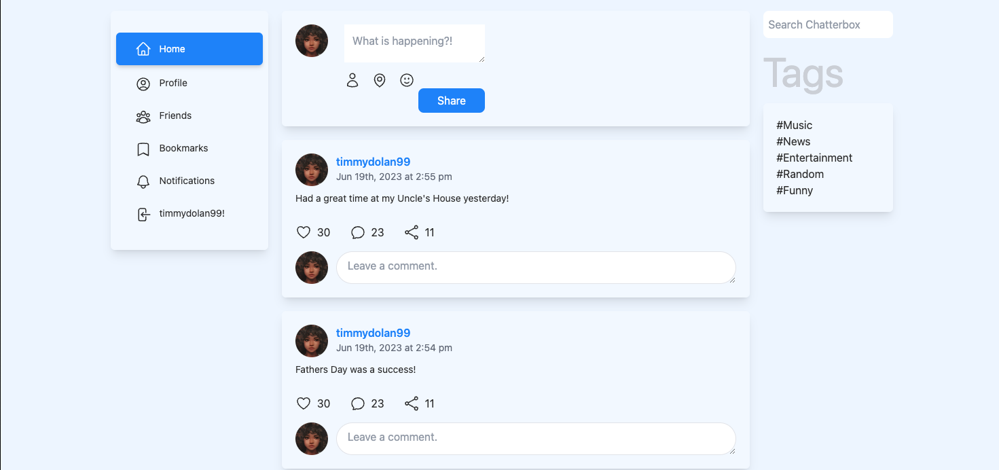

# Chatterbox

## Deployed Site
https://duck-wrist-cat-8cf5ac6915ff.herokuapp.com

## Github repo
https://github.com/Taster101/Chatterbox

## Description

Introducing Chatterbox, the ultimate app for capturing and sharing cherished memories with your loved ones. With its user-friendly interface and intuitive design, Chatterbox enables users to post their most memorable moments and easily share them with friends and family.

Through the app, users can upload text descriptions to share with loved ones, ensuring their personal posts endure for a lifetime, capturing the essence of family vacations, milestone celebrations, and heartwarming everyday moments.

Chatterbox goes beyond the traditional social media experience by allowing users to engage in meaningful interactions. Friends and family can react, comment, and add their own stories to each memory post, creating a collaborative and dynamic space for shared reminiscing.

To further enhance the experience, Chatterbox offers customizable privacy settings, allowing users to control who can view and interact with their memories. Users can also explore a curated feed of memories shared by their inner circle, creating an endless stream of heartwarming and nostalgic moments to enjoy.

Never let precious memories fade away. With Chatterbox, capture, share, and celebrate life's most treasured moments with the people who matter most. Download the app today and embark on a journey of reminiscence and connection like never before.

## How does it work?
Our app utilizes advanced technologies like JavaScript, MERN Stack (MongoDB, Express.js, React.js, Node.js), GraphQL, and npm packages. By utilizing GraphQL, we efficiently manage user profiles and memories. React dynamically populates personalized pages for each user, while API routes are neatly organized using separate JavaScript files, ensuring clean code structure through proper GraphQL queries and mutations.

## Dependencies
All required packages are listed in the included package.json file. On the root level, Simply run "npm install" in the terminal to install all of the required packages.

## Contributors
- [Tim Dolan](https://github.com/timdolan14)
- [Christian Kasegne](https://github.com/christiankasegne)
- [Ethan Bosen](https://github.com/EthanBosen)
- [Davonta Henderson](https://github.com/Taster101)
- [Corey Vesey](https://github.com/CoreyVesey)

## Usage
To review this Site Creation, you can review the notes in each section. Open the Chrome DevTools by pressing Command+Option+I (macOS) or Control+Shift+I (Windows). A console panel should open either below or to the side of the webpage in the browser.

## License
N/A
